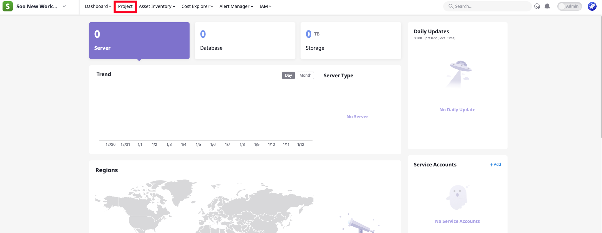
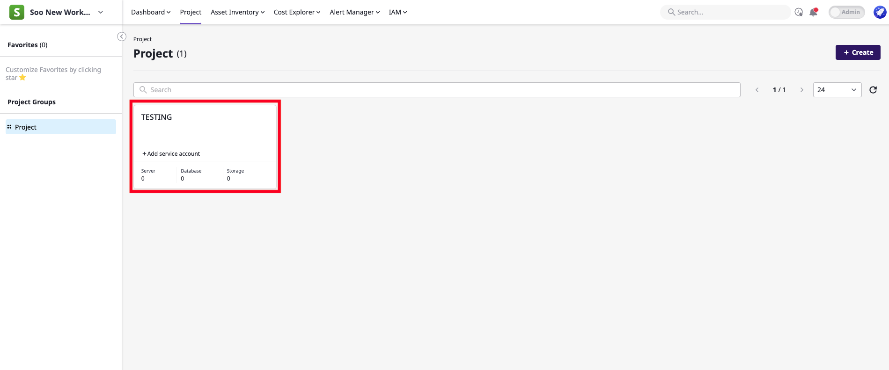
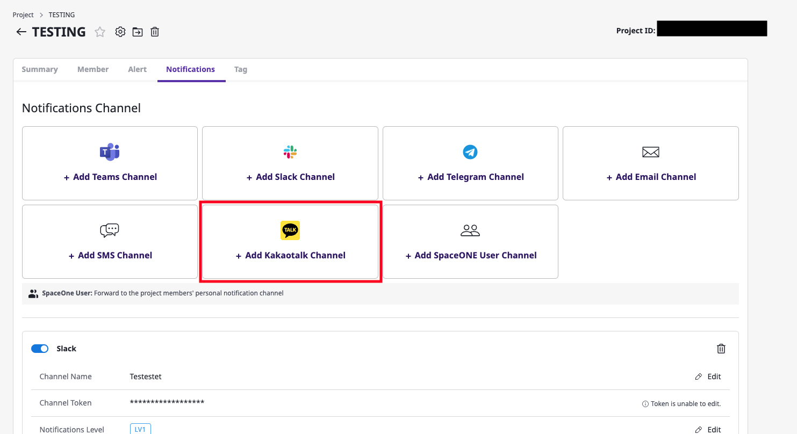
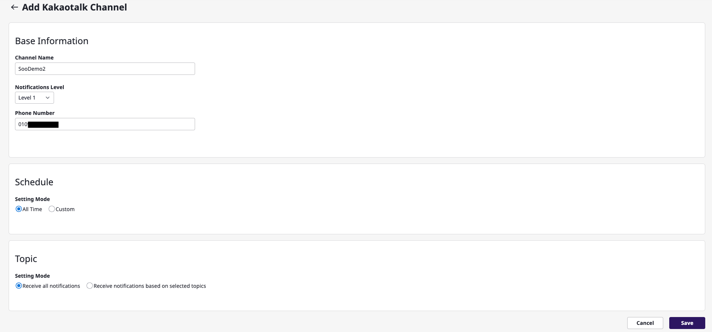
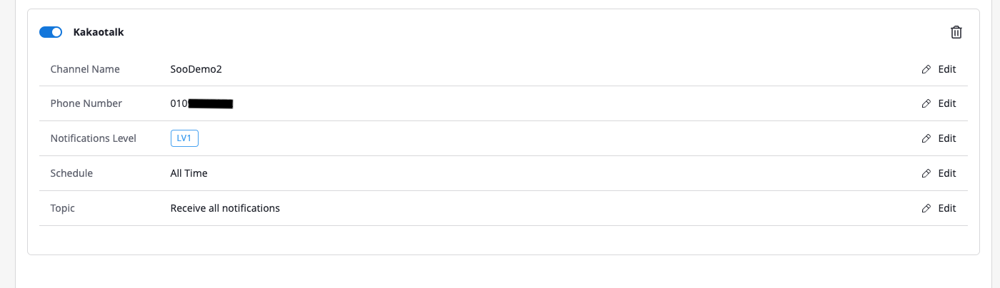
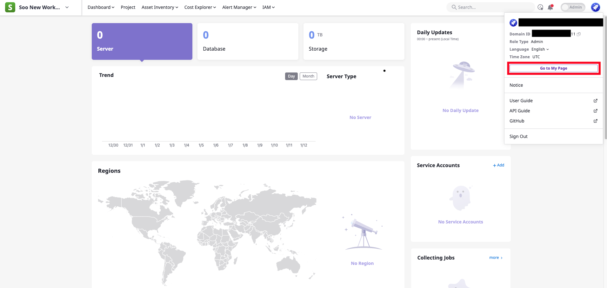
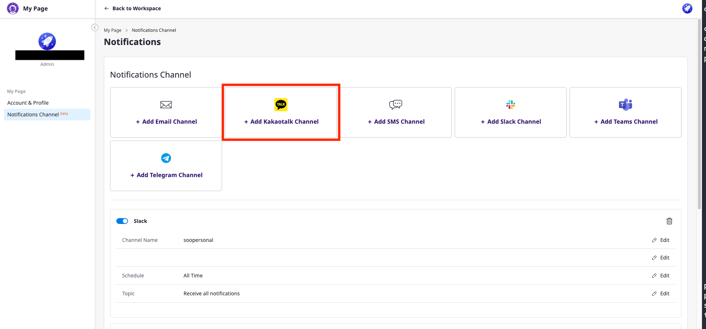
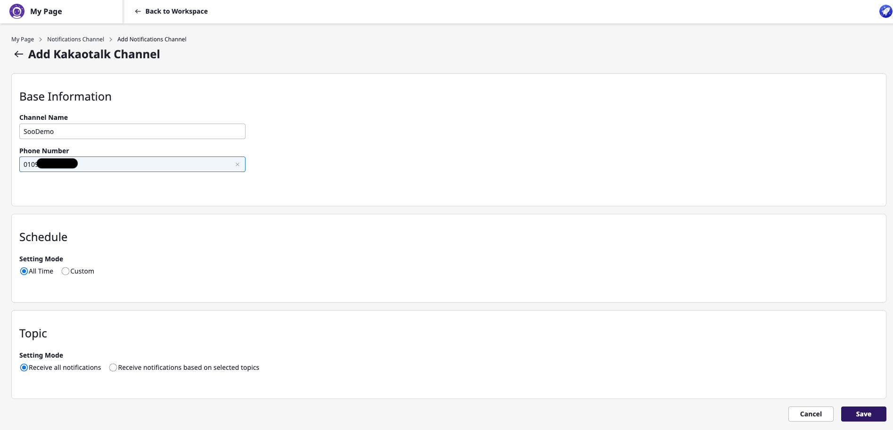
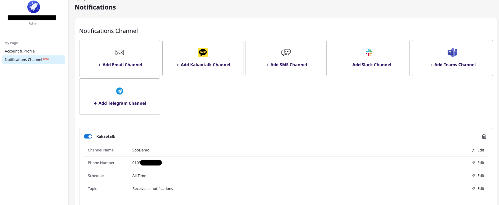

# Overall Outline

Kakao Notification Plugin is designed to act as a means of sending notifications to the users via KakaoTalk.

Kakao Notification Plugin is required to set up a **phone number list** of users who want to receive notifications.

For those who wish to use this plugin, you must first register an **Alert Channel** to register a list of phone numbers
that
you want to receive notifications.

When you register an alert channel, alerts are sent to the phone number list you entered when you registered the alert
channel every time an event or alert occurs.

KakaoTalk alert channel registration process can be done in two ways - (1) Project-wide and (2) Personal - depending on
the scope you want to apply.

## KakaoTalk Alert Channel Registration Process at Project Scope

1. Click the "Projects" tab at the top of the main dashboard page that appears when you log in.
   ####
   

2. Select the project you want to register the alert channel from the project list.
   ####
   

3. Click the "Alert" tab on the project detail page, and then click "+ Kakaotalk Channel Add".
   ####
   

4. In the channel add window, enter the channel name and the phone number list you want to receive notifications, and
   click the Save button.
   ####
   

5. When the channel is added, the alert channel registration for the project is completed.
   ####
   

## KakaoTalk Alert Channel Registration Process at Personal Scope

1. Click the icon in the upper right corner of the main dashboard page that appears when you log in, and click "My
   Page".
   ####
   

2. Click the "Alert Channel" tab on the My Page, and then click "+ Kakaotalk Channel Add".
   ####
   

3. In the channel add window, enter the channel name and the phone number list you want to receive notifications, and
   click the Save button.
   ####
   

4. When the channel is added, the alert channel registration for the project is completed.
   ####
   

