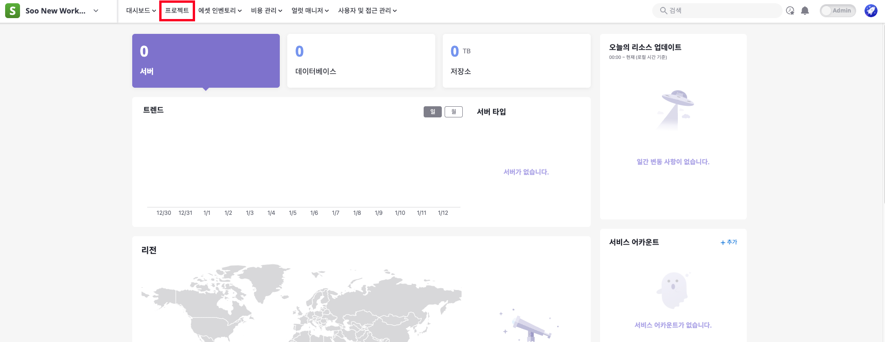
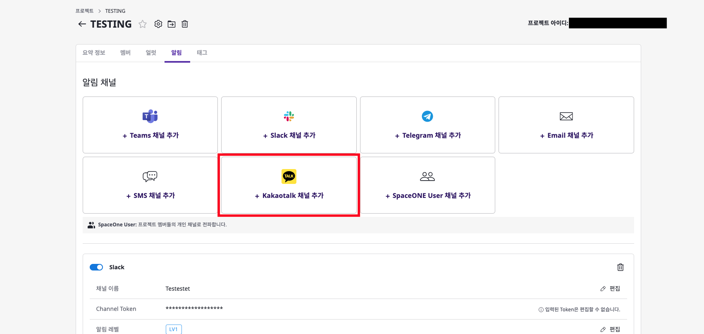
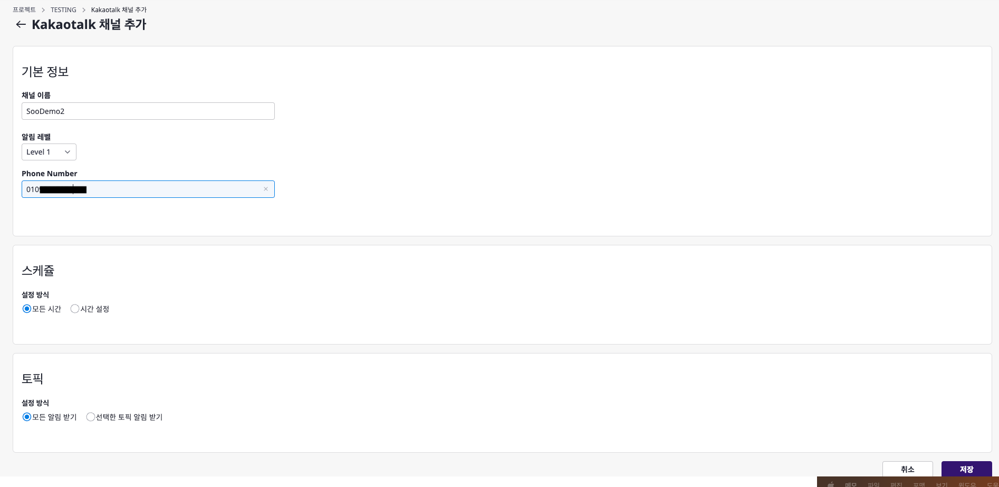
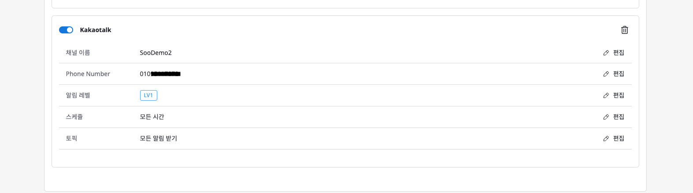
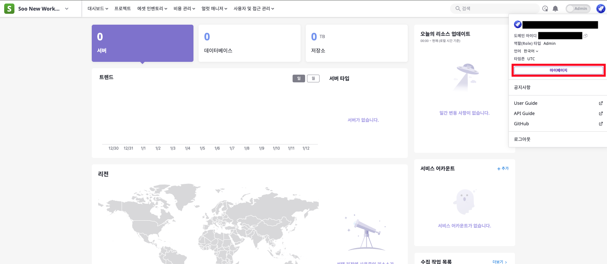
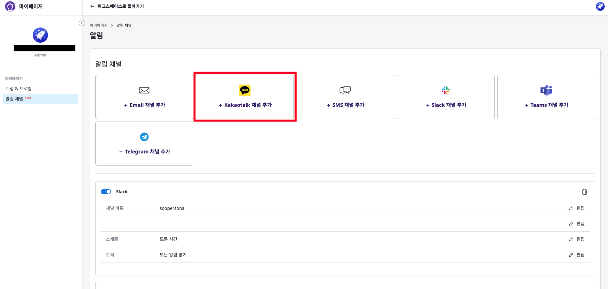
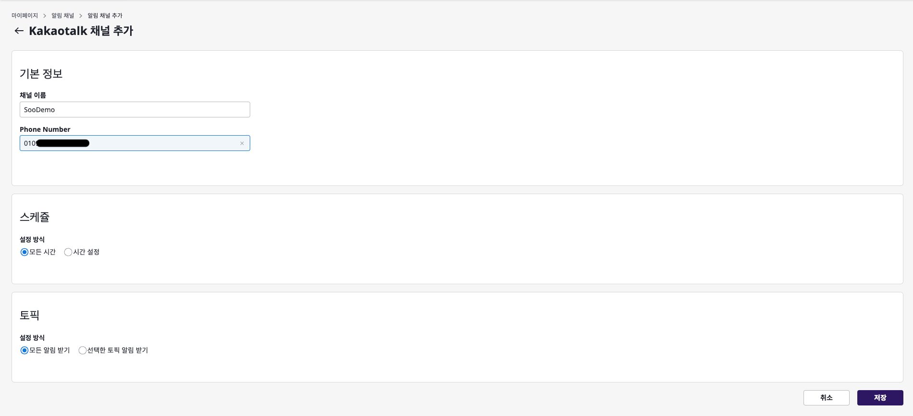
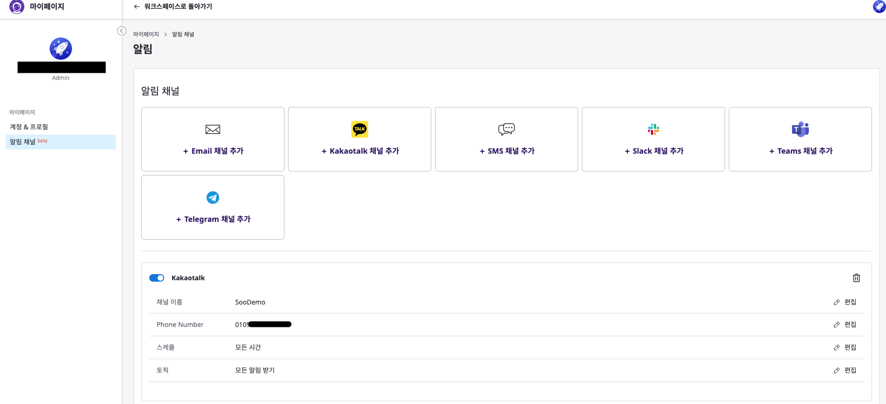

# 개요

Kakao Notification Plugin은 KakaoTalk을 통해 사용자에게 알림을 전송하는 수단으로 동작하도록 설계되었습니다.

Kakao Notification Plugin은 알림을 받고 싶은 사용자의 **전화번호 리스트**에 대한 설정이 필요합니다.

해당 플러그인을 사용하고 싶은 사용자는 먼저 알림채널 등록을 통해 알림을 받고 싶은 전화번호 리스트를 등록해야 합니다.
알림채널을 등록하면 이벤트나 얼럿이 발생할때마다 해당 알림채널 등록 시 입력한 전화번호 리스트에 kakao plugin을 통해 알림이 전송됩니다.

이 알림채널 등록을 하는 방법은 적용하고싶은 범위에 따라 크게 (1) 프로젝트별, (2) 개인별 로 나뉘어집니다.

## 프로젝트 범위에서 KakaoTalk 알림채널 등록 절차

1. 로그인을 하면 보이는 메인 대시보드 페이지의 상단에 있는 "프로젝트" 탭을 클릭합니다.
   ####
   

2. 프로젝트 목록에서 알림채널을 등록하고 싶은 프로젝트를 선택합니다.
   ####
   

3. 프로젝트 상세 페이지에서 "알림" 탭을 클릭한 후, "+ Kakaotalk 채널 추가"를 클릭합니다.
   ####
   

4. 채널 추가 창에서 채널 이름과 알림을 받고 싶은 전화번호 리스트를 입력하고, 저장 버튼을 클릭합니다.
   ####
   

5. 채널 추가가 완료되면, 해당 프로젝트에 대한 알림채널 등록이 완료됩니다.
   ####
   

## 개인 범위에서 KakaoTalk 알림채널 등록 절차

1. 로그인을 하면 보이는 메인 대시보드 페이지의 오른쪽 상단에 있는 아이콘을 클릭하여 "마이페이지"를 클릭합니다.
   ####
   

2. 마이페이지에서 "알림 채널" 탭을 클릭한 후, "+ Kakaotalk 채널 추가"를 클릭합니다.
   ####
   

3. 채널 추가 창에서 채널 이름과 알림을 받고 싶은 전화번호 리스트를 입력하고, 저장 버튼을 클릭합니다.
   ####
   

4. 채널 추가가 완료되면, 해당 개인 알림채널 등록이 완료됩니다.
   ####
   